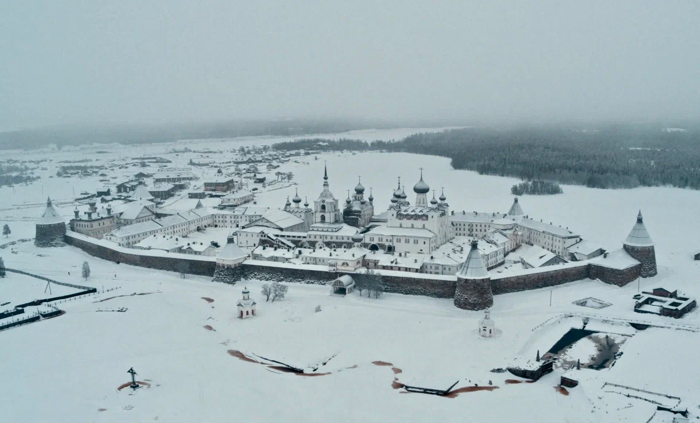

Смотрел тут такого хорошего кина недавно. Святой Архипелаг навзывается. И вот что подумал...

Предупреждаю, кино я сильно не смотрю, критик из меня никудшный. И да, возможно мое мнение предвзято, так как я считаю Соловки одним из самых прекрасных мест в России. А может и самым прекрасным.

Само по себе кино хорошее, светлое, красивое, возвышенное и при этом незамудренное. 
Но я бы хотел затронуть другую его характеристику. Оно похоже на жанро-образующее кино. Сейчас поясню свою мысль. 

Думаю, что зритель скоро устанет или уже устал от бесконечных кинокартин в рамках актеры-сюжет-действия без особого смысла..

Ведь оказывается, что кино без актеров и даже без классического сюжета может быть и интересным и захватывающим. И более настоящим и живым. Фактически, это документальный фильм. Но в нем нет ни одной даты и практически нет персоналий, биографий, истории и прочего что присуще тягучему документальному кино.
То есть это кино больше как притча, как не прозвучавший вопрос: "Ради чего ты живешь?".

Кино которое заставляет думать не над вымышленной ситуаций, вымученным или высосанным из пальца моральным выбором в рамках сюжета фильма.. а побуждает думать про себя, свою жизнь, заставляет если не нырнуть, то хотя бы заглянуть в глубины своих смыслов и ориентиров. Эдакий сеанс кино-психо-терапии. Но очень ненавязчивой, не броской, легкой. Но при этом глубокой. Впрочем глубина зависит только от зрителя. Многие показанные образы и сцены никак не комментируются, что остволяет простор для полета мысли. 

В общем я доволен. Именно такими картинами мы можем показать, что русские могут в самобытное кино. Глубокое, осмысленное, местами дремучее и при этом чистое и возвышенное. Я готов смотреть похожее кино каждый месяц. Спасибо вам.