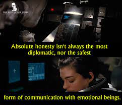
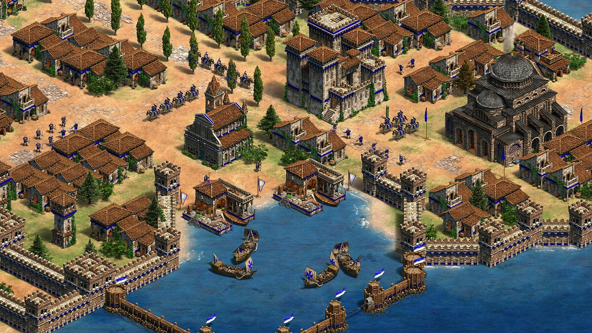
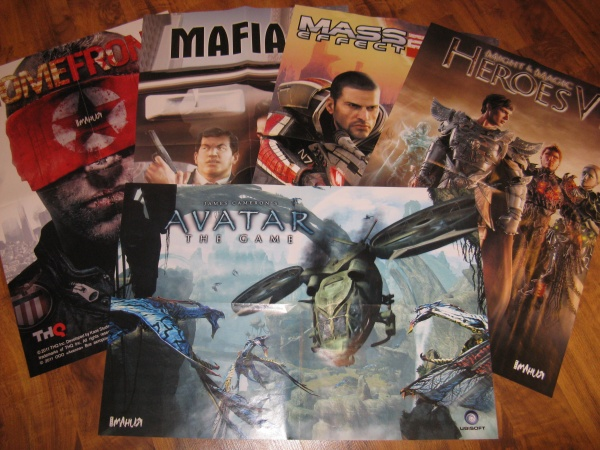
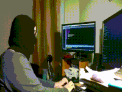
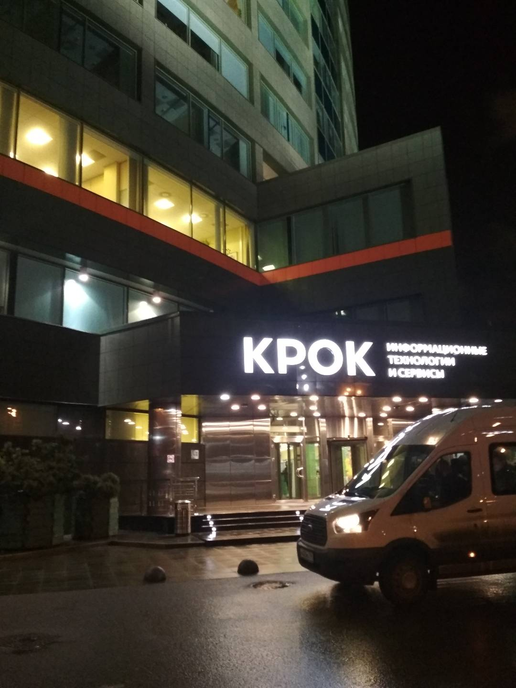
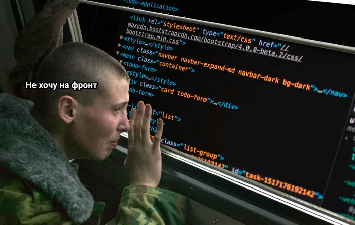

### Какая-такая кривая вывела меня к разработке ПО?

В этом посте попытаюсь как-нибудь интересно описать весь свой айти-путь. Начав с пелёнок. Конечно, мой путь далек от завершения (надеюсь). Да и не похоже это все на классическую success-story. Но для ретроспективы может будет полезно.
Наверное, будет длинно-пост по причине большой любви к себе..

Как написать историю? Все приукрасив? Слишком слащаво выйдет, да и не хорошо. Написать всю голую и нелицеприятную правду? Боюcь, что тогда будущие работодатели и коллеги от меня отвернутся)

Лучше опишу все так, как запомнилось, экспромтом. Но опуская слишком личные, неудобные и совсем скучные моменты, не относящиеся к теме. И пусть читатель сам сделает вывод. Был ли это путь чемпиона-самурая-героя или запутавшегося в себе неудачника с повышенным самомнением.

Там где это возможно буду пробовать вести повествование от лица себя в те годы.

## 1997 (0)

Конечно я не помню ни одну из своих мыслей тогда. Вместо этого небольшое отступление.  

Когда серьезные айтишники описывают начало своего пути там вечно мелькают ZX Spectrum, или Commodore 64. Совсем деды пишут про  ~~фрицев~~ мехмат, лампы и перфокарты. И полеты в космос с 4 килобайтами памяти.

Но когда я родился, в этом мире уже ругали Internet Explorer, обожествляли Macintosh, восхваляли и ненавидели Pentium...Да и собственно моя так называемая "любовь до гроба", Java, уже наверняка запускалась на 3 миллиардах устройствах из тогдашнего десятка миллиона устройств по всему миру..

Но тогда я к счастью об всем этом не знал. А просто радовался яркому, красочному, солнечному, а главное живому миру.

## 2002 (5)

У мамы на самой дорогой Nokia на свeте есть самая крутая игра во всем мире - прыгающий красный мяч.

Java ME? Не ругайтесь при детях, пожалуйста.

## 2003 (6)

<Настольгические звуки dial-up>

Вау, что это за серая скучная коробка которая внезапно появилась у нас дома ?
Для чего она?

Судя по всему, на ней можно делать кучу крутых и полезных вещей: строить замок в Age of Empires, угонять от копов в Need For Speed, обезвреживать бомбу на B..

Буду заниматься этим все свое свободное время. 

Разве компьютеры созданы для чего-то еще?

## 2006 (9)

Хм, как пройти эту миссию с вертолетом?
Посмотреть в интернете? Я не знаю даже что это.

Ха-ха информатика это просто, ведь я так классно рисую ромбики в алгоритме заваривания чая.

## 2007 (10)

Папа совсем не ценит современные технологии. Ну как можно было утопить в борще мега-крутой и супер-навороченный Sony Ericsson, который был с технологией ГолубыеЗубы и hands-free и по нему можно было отвечать не поднимая трубки?

Надо собрать все журналы Игромании и повесить постеры оттуда в своей комнате. 
И не важно что 99% игор оттуда дикий трэш и я в них никода не поиграю. 

Что за нолики и единички в вагонах из учебника информатики?
  

## 2008 (11)

ICQ на тетрадках в школе который передавался от парты к парте как особый вид развлечения. 

Skype на каком очень стрёмном ноутбуке со сломанным пробелом как вершина развития коммуникаций человека. Ведь не надо говорить ртом и смотреть на другого человека. Разве что для совместных игр в Steam с одноклассниками. Но это уж классика. 

## 2009 (12)

Мама показала прикольный мультик про котов под дождем. Что за супер песня на непонятном языке в ней играет?

Английский? Я должен его выучить чтобы понять эту нереально крутую и драйвовую песню. 

Песня была - You in the army now. Оу-о.

Надо б как-то приукрасить мою страницу в Дневник.ру. А то как лох какой-то.

И да, почему мы рисуем в Paint на уроках информатики?

## 2010 (13)

Зарегался в яндекс почте, ВК. Сразу выложил на своей стене крутой мем из 2005 года, который никто из живых до меня не видел. Поставил "Мне нравится" на все анимации и мемы которые видел. 

Это вершина человеческого творчества. Мона Лиза нервно курит в сторонке с Братьями Люмьер.

Стив Джобс - Гений. Айпад первого поколения старшего брата - это плод инопланетных технологий. Внеземные разумы создали этот мега-полезный девайс..
Злые птицы летают из одного угла комнаты в другой целыми днями.

Почему я уже с первой парты не вижу доску?

## 2011 (14)

Айпад первого поколения - старье. Вот второй айпад, подаренный на день рождения -  лучший помощник. Нет, ну вы все нищеброды и просто не знаете Apple. iMessage это так классно. Не надо платить за сообщения!
Ну кто еще может кроме компании Apple добавить столько звуков приходящих сообщений. Выбрал звук печатной машинки. Это же так оригинально и свежо. 
Earpods лучшие уши на свете. Наконец-то понял, что за слова в песнях любимых рок групп. 
Часы сделанные из iPod с помощью ремешка купленного в Apple Store в центре Парижа.
Продавщица на кассе Магнита спрашивает где купил..

Все-таки он гений...Как умер...?

Pascal? В тетрадках? Вы шутите. Это слишком просто и муторно и смешно. Да и глупо. Что могут сделать эти программки и кому они нужны..

Привет, очки. Теперь вы со мной навсегда наверно. Кроме футбола во дворе конечно.

## 2013 (16)

С помощью интернета можно найти что угодно! И спланировать свою жизнь на десятки лет вперед! 

Так, какие тут у нас самые классные университеты мира. О, вот этот с горкой в кампусе и бесплатным обучение для иностранцев подойдет. Мюнхенский технический университет. Отлично. Немецкий вроде несложно выучить. А что там еще есть в Мюнхене? Ого, завод BMW вместе с музеем!
На третьем курсе вуза буду ездить на пары на трешке GT за 15.000 евро. Вроде недорого.
А после учебы приеду домой и.. у нас ведь ценятся люди с заграничным дипломом? Что говорят об этом форумы?...

## 2014 (17)

Хочу быть инженером. Ведь я такой умный. Мне нравятся сложные вещи. Но не инженером в информатике точно. Ведь информатика это просто. 1 и 0, двоичная система. Там все понятно. Программисты вообще непонятно что делают. Витают, понимаешь ли, в облаках. У них все не настоящее, виртуальное. Вот может ли человек в старости сказать своим внукам с гордостью в голосе, что он писал программы? Нет конечно, этих программ уже не будет. А дети побегут за таблетками для деда. А вот дома, например, будут стоять всегда. Буду строителем.

## 2015 (18)

Второй айпад - лучший помощник в подготовке к экзамену по.. физике, конечно. Ребята говорят, что ЕГЭ по информатике это очень просто. Я считаю, что легкие пути для слабых. Буду строителем. А там нужна физика, а не информатика.

Вот и физику сдал замечательно. Теперь надо б загуглить в какой вуз поступать, да и сколько сотен тысяч получают те умники, которые закончили Лучший строительный вуз области.

Какие-то чуваки говорят, что 30к и вечно грязная роба прораба - это мое самое оптимистичное будущее после строяка.

Может выбрать другую сферу инженерии? 
Инженер-электрик? Инженер-механик? Инженер-.. что? Мне показалось или есть профессия инженер-программист? Да не, бред какой-то. Вон инженер-ядерщик это понятно..

Внезапно всё и вся со стороны говорит: ~~"Гарри, ты волшебник"~~ Данила, ты программист. Ведь посмотри какие зарплаты. Да и у компа, в офисе, а не на стройке/заводе.

Да? А я вот думаю, что.. ну ладно, пофиг на собственное мнение. Инженер-программист так программист. Ну и что, что информатику не сдавал. С физикой вроде тоже можно куда-то поступить. На что-то где есть информатика в названии. Ну или вот "Автоматизированные системы обработки информации и управления"

Какой там лучший вуз всех времен и народов? MIT? Caltech? Ну наверное, но наша Бауманка точно должна быть на уровне. Смотрите какой хороший у них сайт. Этот бежевый цвет внушает доверие. Ну да, видео рассказывают про какое то славное и дремучее советское прошлое, а в учебных программах куча непонятных слов. Неважно. Зато посмотрите какое красивое здание! Разве могут здесь плохо учить? Да еще и в столице!

Меня взяли. Ура!

Москва, встречай понаехавших студентов-программистов! 

Еду на поезде в Неризиновск. Читаю на старом айпаде учебник по информатике для вузов. Недавно прошел курс на htmlacademy. Зачем вообще я туда еду если все есть в интернете? 
Наверное очное обучение даст то, чего нет в интернете.. Действительно ведь дало. То, чего нет даже в инетрнете.

## 2016 (19)

Все ребята в вузе абсолютно крутые. Мне до них далеко. Один уже делал шаблоны сайтов, другой был админом какой-то фигни и писал сайты на Пыхе, третий просто всеми своими длинными немытыми волосами говорил что он хакер. Преподаватель по плюсам каждую пару говорит, что он в юности взламывал Пентагон и нас научит тому же. Мы элита. За нами будущее. Ну.. за ними всеми по крайней мере. Я пока знаю только два языка программирования: Pascal и HTML. А еще у меня нет свой машины. Для программирования, естественно. Только айпад.. Подождите. В сумке же был. Как оставил в поезде?! Бывает. Прощай, лучший друг. 

Надо откуда-то взять машину для учебы. Старый MacBook Air старшего брата? Идеально, ведь он такой легкий и зарядку держит 10 часов. В выключенном состоянии.
Ну да ладно. Надо ведь экономить на себе. 

Итак, первый противник - Плюсы. 
Это пушка по сравнению с Pascal. Ведь тут есть cout и cin. Правда в начале надо писать какие-то namespace, да и чтобы русский язык в консоли появился надо сверху что-то непонятное подключать. Да и кодовую раскладку консоли менять. Просто Rocket-Computer Science в чистом виде. Повторяем за преподом который разжевывает нам каждую точку с запятой. 

Спустя три дня ковыряний в XCode или какой-то такой недо-IDE, ОНО выплюнуло мне мой Hello world.

Плюсы кажется выучил. Но какая же сложная первая курсовая - архиватор. 
Надо разбить ее на подзадачи. И первая задача - подсчитать число входящих символов в строке. Это жёстко. Даже очень. Наверное программирование это не мое. Но я не сдамся. 

Жаль нельзя взять ноутбук на пары. Что? В университет и нельзя? Ах да, ведь я учусь не в красивом главном здании, а на режимном предприятии в 25 километрах от центра. Ничего, ради учебы потерпим.

Еду стоя в метро и изрисовываю в сложнейших алгоритмах 24 листовую тетрадку.
Творю в голове целые абстрактные вселенные ex nihilo.
Чувствую себя кулхацкером.

Купил книгу Лафоре о плюсах. Так вот как оно все. А мужики то и не знали. Это обучение было раз в 100 эффективней чем переписывать код с доски. 

Задачу подсчета решил. Алгоритм Хафманна для сжатия, тысячу раз разжеванный преподом и интернетом, написал. Рекурсивный. На 500 строк. Одной функцией. Дебажил 2 недели, но оно работает. Я гений. Держись айти-мир, я иду.

Уверен, что преподаватель даже не открывал мой код. А если бы открыл, то был бы сердечный приступ от качества кода?

Кстати(совсем нет), куда поступили мои одноклассники? Что?? Около половины на похожих около-программистских специальностях? Пфф, вы же не прирожденные программисты, в отличие от меня. Посмотрим, что у вас получится. Ведь вы же к тому же остались в региональных вузах и еще на что-то надеетесь? Ха-ха-ха.

Надо б выбрать новую машину для кодинга. И лучше на форточках, привычной ОС. Вот эта за тридцатку? Подойдет. Ну пентиум ну и что. Да пофиг какие характеристики, просто возьму в Эльдорадо первую попавшуюся и норм. ТРУ пограммист же хоть на калькуляторе должен уметь кодить. Правда ведь?

Конец учебного года. 

...
И что в итоге?

Ниже спины горит так, как будто там была подорвана Царь-Бомба. Зачем программисту начерталка??? Физика? Высшая математика терпима, но история, социология? Вы верно издеваетесь. Я для этого за 400км от дома уехал? Чтобы слышать как какой-то непонятный чел читает мне 20-летние лекции с бумажки? Я же будущий программист, гроза информационного мира! Мне нужна только акутальная информация в удобоваримом виде! Я - губка, приехавшая впитывать знания.. а не слушать шутки старых пердедов! Так программистом не стать. По крайней мере быстро.
Я построю собственную учебную программу. Без ваших всяких.

Но надо выбрать язык программирования. Обязательно не такой как в вузе. Плюсы это хорошо, но первый во всех списках - java. Это будет мой язык. Мой язык - мой лучший друг. Моя жизнь. Мой язык лучший на свете. ~~Все остальные языки ему завидуют.~~ Пусть все остальные учат свои трижды никому ненужные языки без автоматической сборки(очистки) памяти. Мой язык особенный. Как и я. 

Я идеален в программировании, но чтобы стать еще лучше я поступлю в крутейшее место для обучения программированию - Технопарк от Mail.ru

Готовлюсь все лето. Смотрю лекции, разбираю задания. И вот он долгожданный отбор.

Случайно прохожу тесты, выбрав половину вариантов наугад. Ладно.
Мое финальное задание - рассказать как бы я построил высоконагруженную систему. Отрывки моего ответа великолепны:  "Конечно для прототипирования выбрал бы модный нынче Python.... Для увеличения производительности использовал бы шардирование баз данных. ...Очень важна грамотная настройка load-balancer'a...". И так далее.
Ни в одной из этих сказанных вещей я не разбирался. Но похоже самому важному навыку айтишника, говорить непонятными словами, я уже научился. 

Меня взяли. Ура! 

## 2017 (20)

У всех настоящих программистов есть гитхаб. Надо завести свой. Хмм, никнейм..? Назовусь Java-Man. Типа питекантроп. Ахаха. Ну вы поняли? Человек с острова Ява? Вот это самоирония типа я вообще ничего не знаю в айти, как первобытный чеовек. АХАХА. Вот умора.

Я однозначно лучший программист в группе. Ну кроме разработчика игрового движка и другого пыха-парня который сделал 3D модель снеговика на OpenGL с крутящимся на спине символом третьего рейха.. Н-да..

Говорят после Технопарка все зарабатывают сотни тысяч и ездят на мерсах. Не верю)

В самом технопарке рассказывают про продвинутые плюсы и Django. Потоки какие-то, вектора, boost, асинхронщина, С++ темплейты смешались с питоновскими генераторами, админками и работой с бд. ОЧЕНЬ СЛОЖНА. Надо делать свой проект. Собрал случайных челов и давай делать какой-то невнятный Telegram-bot с не простой логикой. Что-то где-то ~~украл~~ скачал чужое для основы, пишу тысячи слов в наш командный чатик и.. команда распалась. Сроки поджимают. Проект не готов. А есть ведь еще основная программа бомонки. По электротехнике (SIC! ОНА ТО ЗАЧЕМ НУЖНА ПРОГРАММИСТУ) грозит неуд. 

Технопарк пришлось бросить.
Закрыл долги. 

Летом собрал список всех образовательных программ в Москве по программированию.
Что за школа Netcraker? Там вроде Java и трудоустройство после? Погнали!

Н-да интерфейс обучающей системы конечно подустарел, ну да ладно. Да и программа старая и никто задания не проверяет. Ну ок. Может на очной части программы будет лучше. Спойлер: не стало.

Надо скупить все книги по программированию в магазине. Читать не обязательно.

Как истинный программист поставил себе линукс. Ubuntu 16.06. Не смог правда починить загрузку из BIOS и переходил между системами с помощью загрузочной флешки. Но в целом понимание, что у меня косорукого, теперь dual-boot делало из меня компьютерного гения, не иначе. 

У каждого Настоящего программиста есть блог. С помощью нехитрых манипуляций с Github Pages и Jekyll теперь и у меня есть. Хе-хе, мечта становится ближе.

## 2018 (21)

3 курс. Пора переставать страдать ерундой и идти работать.

В бомонке затирают полную чушь. Какой-то странный чел учит нас как рисовать в Блендере. Другой учит собирать мультивибраторы в Prometheus. Практически нет ни одного предмета по программированию.
Есть разве что Базы Данных с нормальными формами и булевой алгеброй. Скучняк. Давайте, напишете мне вложенный селект с джойнами на булевой алгебре

О, ура, лабы по Python. Можно повыпендриваться и поднять свой сайт на коленке который будет генерировать пдф отчеты по этим самым лабам.

Иду на первое в жизни собеседование в день программиста.
Что говорите? Поддерживать легаси за копейки на незнакомых мне технологиях? Готов с рождения, завтра выхожу!
По моим горящим глазам интервьюер понял, что я ничего не знаю о жестоком мире кровавого энтерпрайза и предположительно не справлюсь, и отпустил меня с миром. Провал. Ну да ладно. 

Есть еще собесы. Москва - город возможностей. Особенно когда ты студент всем известного вуза, а не чувак с улицы. Какой-то BPMN предлагают ковырять. Ну ок погнали. Прошел собес? ~~Ура, меня взяли~~. Странно, но не хочу у вас работать, там вон лучше знакомую мне Java предлагают. Отдел микросервисной архитектуры. О как. Ни хухры мухры.

Меня взяли. Ура!

Надо купить себе новый комп. Так, что лучше AMD или Intel? А нужна ли мне Windows ? Зачем переплачивать за это недоразумение. Лучше проц пошустрее возьму. Обязательно Core i5. По другому никак. На плохих машинах кодят не настоящие программисты. 8 гигов памяти - да, сойдет. Итак - ноут за 50 нормально. Отличная вещь.

Вузовская программа летит в пропасть. Все дополнительные курсы тоже. Зачем? Если вот она желаемая работа.

Зачем вуз, если в вузе я не разу не услышал даже слово Docker? Хотя технология просто пушка!
Зачем вуз, если там учат админить Active Direcory по методичкам 10 летней давности.

Да, там сейчас проходят нейронные сети.. Но это не моя специализация. Я буду творить бэкенд часть на Java. Остальное все лишнее. *Вот дурак.* 

Наконец докажу всем, что я тру-программист.

...

Это было жостко.

Почему мой ментор спрашивал у меня где взять их документацию,а не наоборот?
Почему на третий день работы я уже должен поднять какую-то платежную омниканальную платформу какого-то банка состоящую из более чем 10 сущностей? Без доступа к инфраструктуре и части кода.
Почему человек с которым мы познакомились минуту назад с надменным видом знатока доказывает, что мое понимание инкапсуляции ущербно?
Почему все вокруг такие неприветливые и кто-то за соседним столом кричит матом в трубку?

Много вопросов. Мало ответов. Надо валить. 
Похоже это был не самый удачный выбор.
Фирма обанкротилась спустя несколько лет. 

## 2019 (22)

Наверное я не программист. Вообще нисколько. Для этого надо наверное прочитать всего Дональда Кнута и дописать самому шестой том.. Самому научиться не вышло. Но кто же меня научит?

Вуз надоел, пойду схожу в академ чтоли отдохну. 

Наверное я выбрал не тот язык и не ту сферу. Нужно было глубже изучить плюсы и идти куда-нибудь на завод системным программистом. Например на военный завод делать реальные вещи. Почему бы нет? Вооружаюсь книгами Страуструпа и Александреску. Сложно.  

Надо создать очередной план обучения. Назову его CppNinja. Распишу на 10 лет, для верности. За 10 лет я уж точно все выучу.
Курсы на Степике, Курсере. Современные плюсы - отличный язык. Но вот алгоритмы..
Да и кто бы научил не сдаваться. Приходит понимание, что низкоуровневому программированию учиться еще больней.

Платные и бесплатные онлайн-курсы это весело. Но практически бесполезно. Что дальше? Нужно что-то в оффлайне.

Кажется есть что-то на примете оригинальное. Школа 21. От Сбербанка. Куплена лицензия у французов. Даже Путин там засветился на открытии.  Сотни новеньких маков. Туда нам надо.

"Бассейн"  школы 21 - это бомба. Каждый должен попробовать в своей жизни. 
Хоть я был уже "с опытом", но это как прыгнуть в холодную воду после душной бани академического и ада профессионального кодинга. Сотни новых людей. Полное раскрепощение. Кайф от каждой строчки кода на С. Лучшие занятие и друзья в одном месте. Я впервые не спал 2 дня подряд и беспрерывно кодил. Впервые терял ориентацию в пространстве после того как встал из-за стола после 14 часового кодинга. Это безумие и оно мне нравилось. Вообще, все чаще замечаю, что среди программистов много безумных братьев. 

Кого-то увозили оттуда на скорой. С сердцем может плохо стало, может в голове Segmentation Fault произошел..

Тем не менее очень здорово. И это только отборочный этап. Что же будет в основной программе?

Меня взяли. Ура!

Учиться в школе 21 сложно и интересно. Медленно иду в своем темпе и по своему графику, на расслабоне кайфую от чистого, как слеза стажера, С. Чудесное время. Посетил также зимнюю Java школу Крока. Ничего так, сойдет. 

## 2020 (23)

Пора возвращаться в вуз и досдавать долги. 
Я вроде как уже на 4 курсе. Но лучше в плане программы не стало. 
Может долгожданный диплом что-то да значит? Да нет, все какую-то фигню нерабочую делают, кроме десятка гениев с нейро-сетями.

В вузе совсем тухло. В школе весело. Вечерами и ночью зависаю там. Жить можно.

Какая удаленка? Какой дистант? Н-е-е-ет. Ничего ущербней сдачи экзаменов в зуме я не видел. И в школу21 нельзя ходить? Настраивать VPN для работы в школе.. зачем если весь кайф в личном общении. 

Привычный мир нарушен.

Поеду-ка я домой. В деревню, к тетке, в глушь, в Саратов.
Больше в эту дефолтную дыру, пожирающие человеческие души, не вернусь. Отвык от суеты, да и от программирования. Наверное я и вовсе не программист, да и вышка мне не нужна. Ничего не нужно. Совсем уже все с ума посходили со своими масками и жизнью на удаленке.

Удаляюсь из всез соц-сетей и даже из Телеграмма.

## 2021 (24). 

Какой-то незнакомый через третьи руки нашел меня, чтобы я помог ему с дипломом на C#. Чтож, ок. Свой не напишу. Так чужой хотя бы. Было просто и скучно.

Такс, ковид кончается. Можно вылезать из норы и попробовать войти в айти заново.
Поищем что-то поблизости. Вот курсы по Spring.
Курсы хорошие, легкие. Пишу маме сайт ресторана. С админкой, блогом, бронированием,  тестами, деплоем в докере, интеграцией с ВКонтакте, телеграм ботом, и прочими радостями жизни. Я у мамы программист.

Через пару месяцев при взгляде на код хочется его выбросить и забыть как страшный сон. Ну и ладно.

После курсов замаячила работа. 
Коллектив отличный. Приняли замечательно. Команда - маленькая семья в которой ну очень комфортно работать. Зарплата растет. Коллеги хвалят и дают новые более сложные задачи..Ментор начинает посвящать меня в секреты идеального кода и DDD. Это реально крутые идеи, которые конечно сейчас я восприму их со скепсисом... но зато потом придет понимание, что такая личная передача опыта и знаний это бесценно и больше со мной так нянчится никто не будет. Я стал программистом? 

Да вроде нет. Я же не знаю, например, как правильно поднять и настроить с нуля Kafka которая будет обслуживать сотню инстансов. Ну не помню просто наизусть какой код нужно писать для ее конфигурации. Но знаю что смогу разобраться.

Купил лицензию Intellij IDEA. Страшно этим гордился и всем рассказывал. Даже тем, кто не знал, что такое IDE. Ведь я теперь профессионал, если у меня есть профессиональный инструмент, оплаченный из собственного кармана. 

Надо снова обновлять компы. На этот раз в поле зрения только десктопы. Ведь три монитора и ноутбук использовать сложно. Один стоковый за 36. Оказался фигней из-за особенного TFX-блока питания. А я уж хотел проэпрегйдить. Ладно. Соберу первый раз в жизни комп сам.
Обязательно Core-i5. Самый новый. И минимум 16 гигов памяти. 80 тысяч ? Фигня вопрос.

Вроде норм. Даже ожило с первого запуска.  Позже соберу еще один. Надо только 32 гига, а лучше 64. Java в докере, IntellijIdea и 100 вкладок браузера съедают все.

И чтобы лето круглый год и белый пароход, и я пишу свой java-код!

## 2022 (25)

Помимо работы иногда родственники просят покопаться в роутерах, iiko, POS, сканерах на работе. Иногда получается. Чаще развожу руками. Не знаю и все, почему не работает.. Но меня уже не волнует как бывало раньше если я чего то не знаю или не умею.  

Наш маленький проект на работе явно требует расширения команды. Но вся команда наоборот разошлась, разхехалась и разлетелась, а от изначального состава остался я один. Грустно. Менеджер называет меня синьером, но я чуствую себя глупее джуна, хотя на мне ответственность за целый проект, деплой, тестирование, демонстрации, интеграции и прочее. И все вроде получается. Ну кроме того, что заказчик хочет конечно. Но приелось. Кажется, чтобы вырасти, настала пора уходить. Пока в неизвестность. Что дальше не знаю.

Опять сомнения.

Да и какой смысл в айти когда пришла война?

Может я и не программист вовсе? Типичный самозванец с синдромом программиста.

Да, я учился в вузе, учился на курсах, учился в школах, занимался ~~самообманом~~ самообразованием, писал код на десятке разных языков, работал на всех популярных операционных системах, умею общаться с людьми про технологии, проводил свои лекции по программированию и побывал в шкуре репетитора, читал книги умных и не очень людей об айти, переводил айти-книги и статьи, вел свой блог, смеялся над айти-мемами, которые поймет только тысяча людей со всего шарика, вел беседы с заказчиками - американцами, посвящал турка-новичка в тонкости проекта, отвечал на вопросы индуса-сеньора о качестве нашего проекта, писал документацию, тесты, комментарии, находил ошибки в коде сеньоров, критиковал JS, потратил не одну и не три сотни тысяч на компьютерные приблуды, каждый день читаю про новые технологии и новости айти мира, заработал за компом близорукость, туннельный синдром запястья и сколиоз с остеохондрозом, провел половину осознанной жизни за персональной ЭВМ .. но все это не делает меня программистом. Программисты это те кто запускали ракеты в космос имея 4 килобайта памяти. Джеймс Гослинг, Илья Сегалович, Стив Возняк, Брайн Керниган и Деннис Ритчи, Маргарет Гамильтон, Линус Торвальдс, Михаил Романович Шура-Бура, да даже создатель крутящегося в консоли пончика на чистом С.. они - программисты. 

Я так, имитация. Резиновая желтая уточка. Ведь только исходя из утиной типизации меня можно считать программистом. 

К концу года профессионально я так и не вырос. Разве что морально. Осознал, что все это.. ерунда. Все эти заморочки и загоны по поводу образования, языков, денег, технологий, места работы.. Мелочи жизни, никак не влияющие ни на что. Разве что на текущий сиюминутный успешный успех отдельно взятой компании или человека или бизнеса. Который выльется разве что в лишнюю пачку денег. У клиентов, стейкхолдеров, да и у меня.

Вот я умру когда-нибудь. Понадобится ли мне там, за гробом, знание того как идеально настроить Hibernate чтобы он выполнял запросы максимально быстро и не жрал память? Или спросят ли меня *там* сколько паттернов проектирования я знаю и что такое SOLID и ACID? Вряд ли.

Это не значит, что айти мне больше не интересно, или не нужно, или абсолютно понятно и я до конца преисполнился в своем познании. Вовсе нет. Просто оно должно быть на своем месте. Как и все подобные вещи в жизни.. Не в сердце, а в голове. Да и то на время работы, оплаченное деньгами. Или на время узнавания нового и игры с технологиями, оплаченное дофамином.

Слишком много было восторгов или разочарований, слишком много уныния от неудач и превозношения даже от самых маленьких успехов.. Оттого, что айти как профессиональная отрасль, да и одновременно любопытная веха в развитии человечества, реально были близки к сердцу и не воспринимались трезво.

В сердце должны быть более важные вещи чем все это. Вот что я понял на данный момент.

# 2023 (?) 

